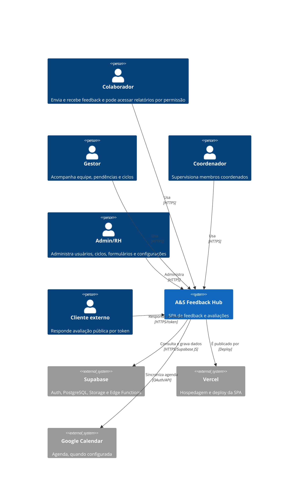

# Arquitetura — A&S Feedback Hub

## Visão

SPA React/Vite em TypeScript, com roteamento no cliente, autenticação e persistência no Supabase. A UI organiza fluxos por papel e domínio; queries React Query acessam diretamente tabelas e Edge Functions. O deploy é configurado para Vercel.

## C4 Contexto

## Riscos e dívidas

- 🟡 A lógica de agregação e autorização está distribuída em páginas e componentes, aumentando o acoplamento ao schema Supabase.
- 🟡 Há rotas duplicadas para coordenador no `App.tsx`, sinal de manutenção incompleta.
- 🟡 Queries amplas no cliente exigem validação de RLS para garantir isolamento de dados.
- 🟡 Alguns componentes usam `any` e casts para tabelas que não aparecem integralmente nos tipos gerados.
- 🔴 Cobertura de integração com Edge Functions e políticas RLS não foi comprovada.
