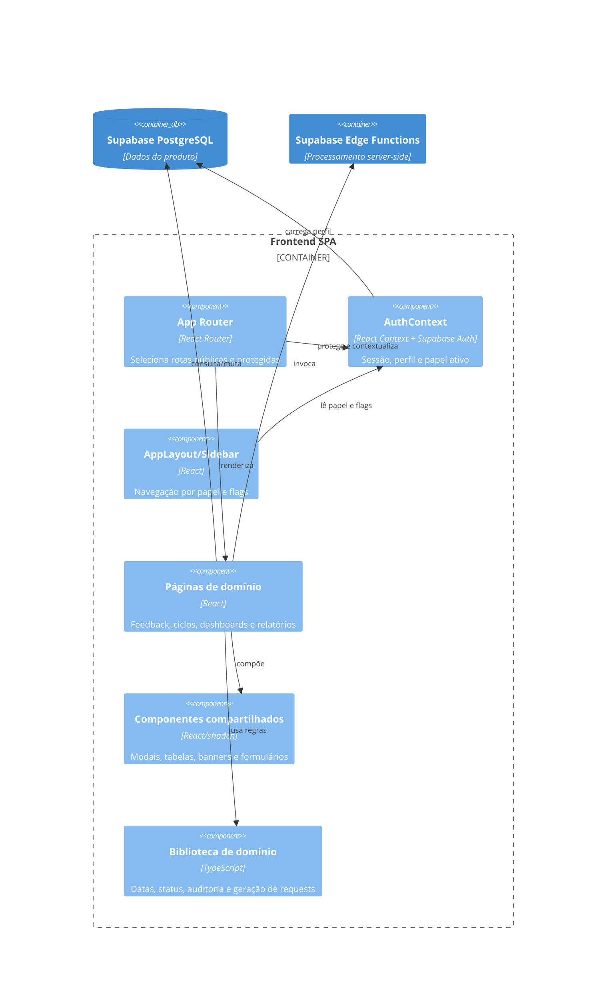

# C4 Componentes

## Frontend SPA

## Relatórios

- `AdminRelatorios`: filtros, tabelas, agregações e CSV.
- `AdminRelatorioFeedback`: construção de dados, análise textual/IA e PDF.
- `ColaboradorRelatoriosClientes`: relatório filtrado de avaliações de clientes.

🟢 Componentes e responsabilidades são derivados dos arquivos analisados. O detalhamento interno das Edge Functions é 🔴 **LACUNA**.
