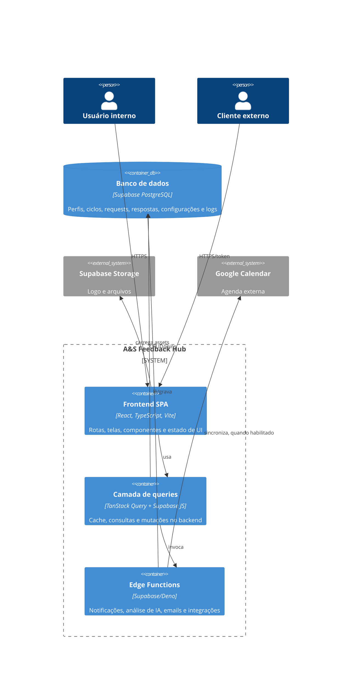

# C4 Containers

```mermaid
C4Container
    Person(user, "Usuário interno")
    Person(client, "Cliente externo")
    System_Boundary(hub, "A&S Feedback Hub") {
        Container(spa, "Frontend SPA", "React, TypeScript, Vite", "Rotas, telas, componentes e estado de UI")
        Container(query, "Camada de queries", "TanStack Query + Supabase JS", "Cache, consultas e mutações no backend")
        Container(functions, "Edge Functions", "Supabase/Deno", "Notificações, análise de IA, emails e integrações")
    }
    ContainerDb(db, "Banco de dados", "Supabase PostgreSQL", "Perfis, ciclos, requests, respostas, configurações e logs")
    System_Ext(storage, "Supabase Storage", "Logo e arquivos")
    System_Ext(calendar, "Google Calendar", "Agenda externa")
    Rel(user, spa, "HTTPS")
    Rel(client, spa, "HTTPS/token")
    Rel(spa, query, "usa")
    Rel(query, db, "CRUD/joins")
    Rel(query, functions, "invoca")
    Rel(spa, storage, "carrega assets")
    Rel(functions, calendar, "sincroniza, quando habilitado")
    Rel(functions, db, "lê/grava")
```

🟡 A separação entre camada de queries e Edge Functions representa responsabilidades observadas, não containers implantados necessariamente como serviços independentes.
