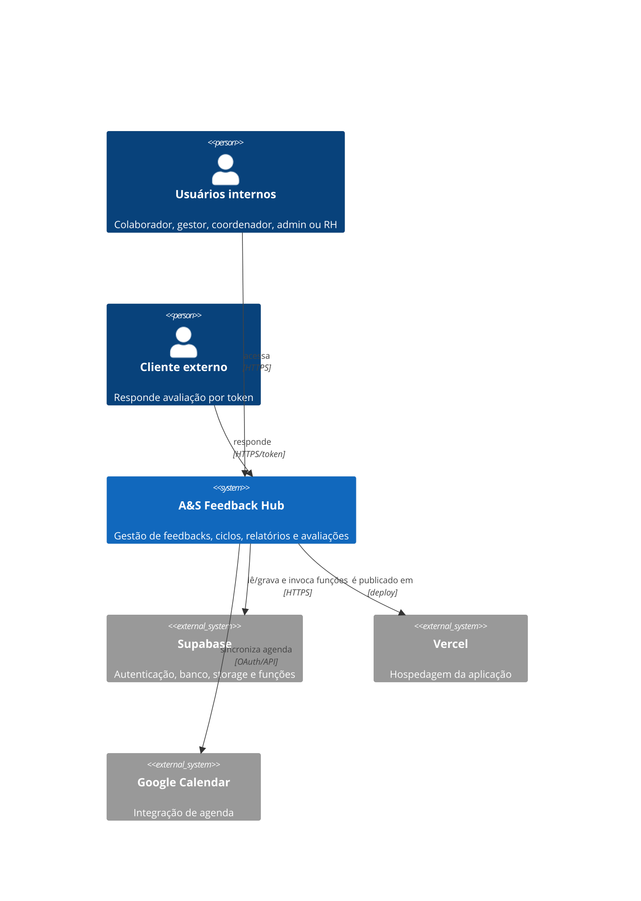

# C4 Contexto

```mermaid
C4Context
    Person(user, "Usuários internos", "Colaborador, gestor, coordenador, admin ou RH")
    Person(client, "Cliente externo", "Responde avaliação por token")
    System(hub, "A&S Feedback Hub", "Gestão de feedbacks, ciclos, relatórios e avaliações")
    System_Ext(supabase, "Supabase", "Autenticação, banco, storage e funções")
    System_Ext(vercel, "Vercel", "Hospedagem da aplicação")
    System_Ext(google, "Google Calendar", "Integração de agenda")
    Rel(user, hub, "acessa", "HTTPS")
    Rel(client, hub, "responde", "HTTPS/token")
    Rel(hub, supabase, "lê/grava e invoca funções", "HTTPS")
    Rel(hub, vercel, "é publicado em", "deploy")
    Rel(hub, google, "sincroniza agenda", "OAuth/API")
```

🟢 Auth, DB, Edge Functions e Vercel são confirmados no inventário. A integração Google é confirmada por entry points/configuração de agenda; protocolo detalhado é 🟡 **INFERIDO**.
