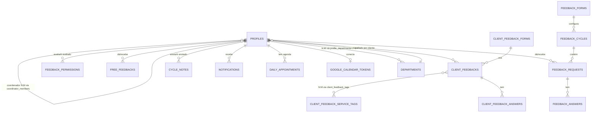
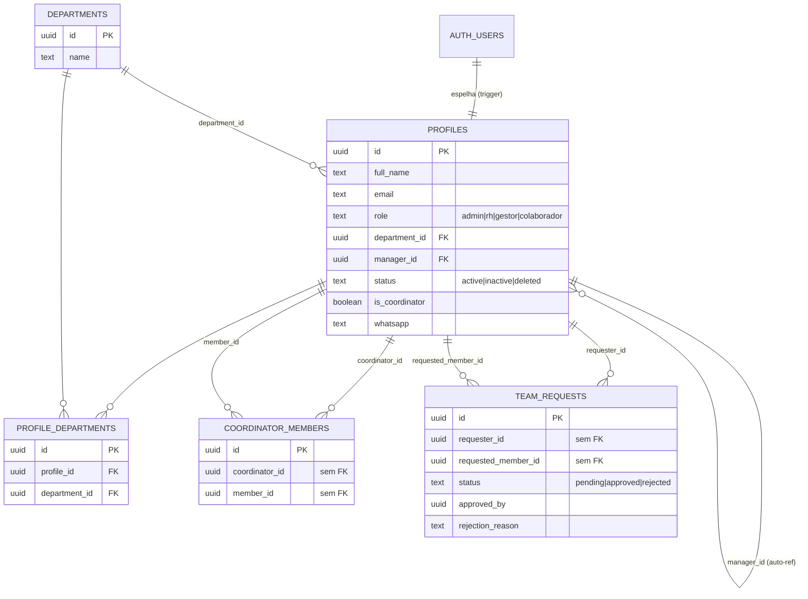
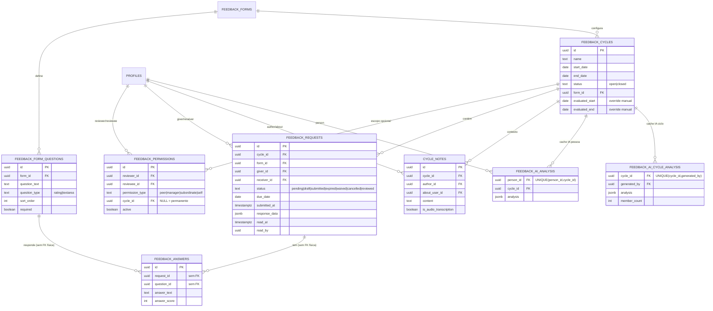
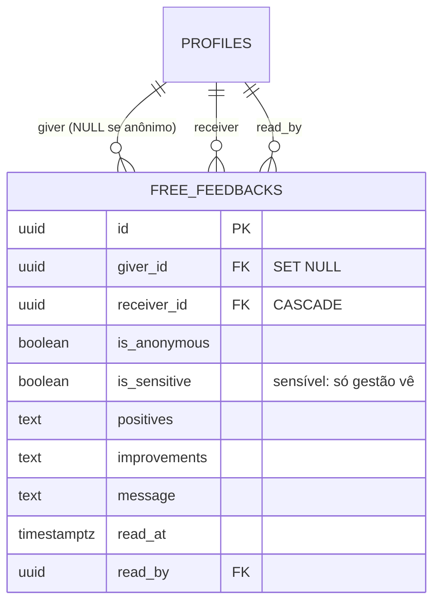
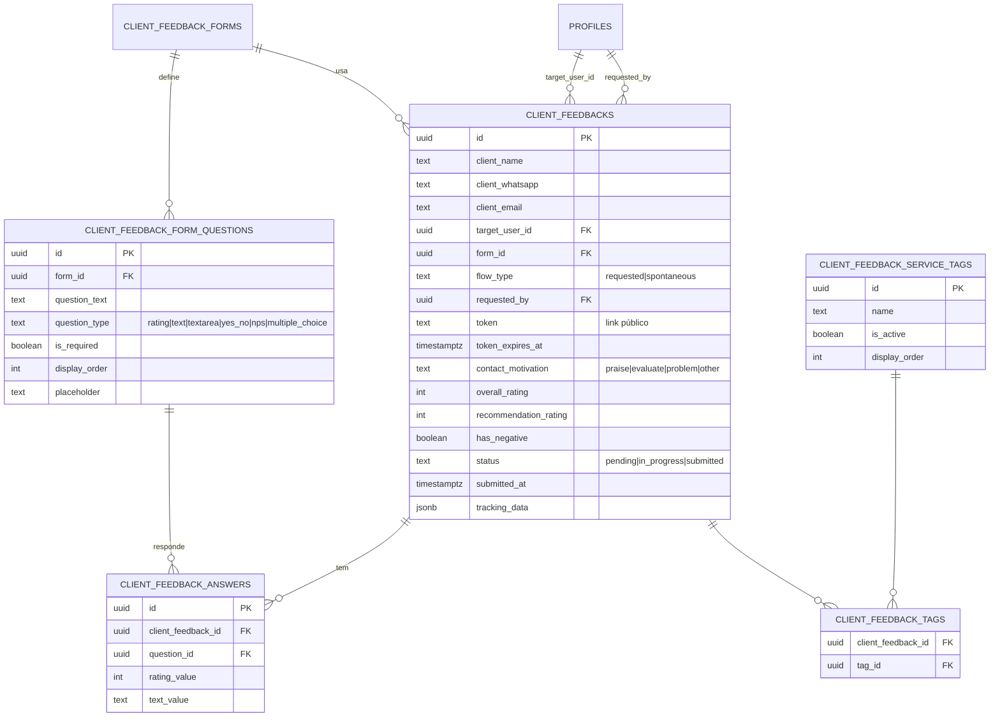
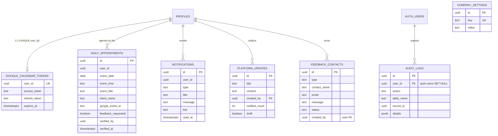

# ERD Completo — Banco de Dados

> Gerado pelo **Data Master** (Reversa) em 2026-08-28.
> ERD geral simplificado + ERDs parciais por domínio. Entidades 🟡 têm estrutura inferida do código (ver `data-dictionary.md`).

## ERD geral (simplificado)

## Domínio: Identidade & Organização

## Domínio: Feedback interno (ciclos 360)

## Domínio: Feedback livre

## Domínio: Feedback de clientes (fluxo público) 🟡

## Domínio: Agenda & Plataforma 🟡

🟢 Domínios de identidade, feedback interno, feedback livre e plataforma confirmados por migrations. 🟡 Domínios de clientes e agenda inferidos do código; a marcação "sem FK" indica coluna uuid sem constraint física confirmada.
