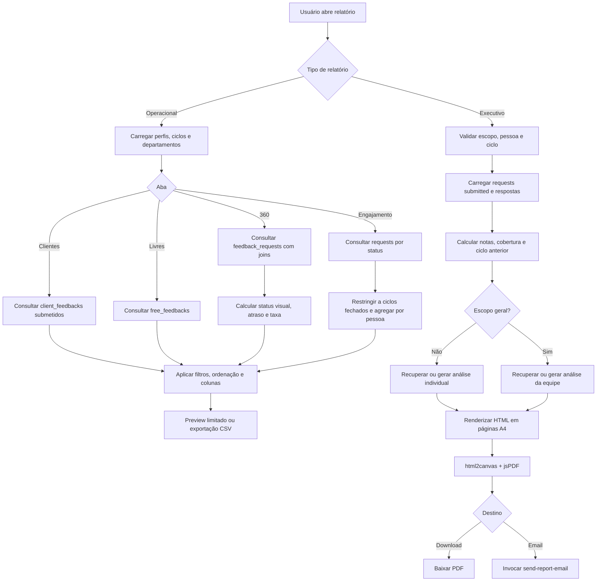

# Fluxograma — Relatórios

## Regras críticas

- A taxa 360° divide requests `submitted` pelo total filtrado.
- O engajamento percorre somente ciclos com status `closed`.
- A geração executiva ignora pessoas sem feedback submetido.
- Análises de IA podem ser lidas do cache antes de invocar as Edge Functions.