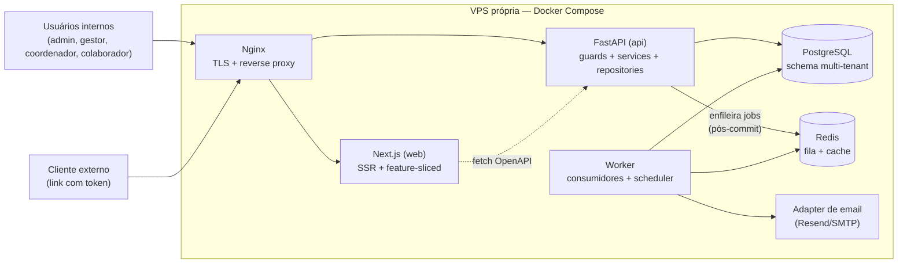

# Target Architecture

## Visão geral

SaaS multi-tenant em VPS própria, num único deploy Docker Compose: Next.js serve a interface e consome exclusivamente a API FastAPI via contrato OpenAPI; a API concentra autorização, invariantes de domínio e acesso ao PostgreSQL; um processo worker consome a fila Redis para todos os efeitos assíncronos (notificações, emails, exportações) e roda o scheduler dos jobs de ciclo. A separação por bounded context é lógica (pacotes), não física (microsserviços) — adequada ao tamanho do time e evolutiva.

## Diagrama



## Componentes

| Componente | Tipo | Responsabilidade |
|---|---|---|
| Nginx | Gateway | TLS, roteamento web/api, rate limiting do endpoint público (BR-MIGRAR-019) |
| Next.js (`apps/web`) | Frontend | telas por feature, SSR, consumo do client OpenAPI gerado; zero regra de negócio |
| FastAPI (`apps/api`) | API | routers por contexto, guards de autorização (tenant + papel + flags), services com invariantes, repositories |
| Worker (`apps/worker`) | Worker | consumidores da fila (notificações, email, exportações) + scheduler (fechamento de ciclo com carência, expiração de tokens) |
| PostgreSQL | DB | schema multi-tenant único; migrations versionadas (Alembic) |
| Redis | Fila/Cache | fila de jobs (com retry exponencial + DLQ — AMB-006) e cache de leitura |
| Adapter de email | Integração | Resend ou SMTP, configurável por env (BR-MIGRAR-030 / R-11) |

## Bounded contexts

| Contexto | Responsabilidade | Justificativa de agrupamento |
|---|---|---|
| `identity` | tenants, usuários/credenciais, perfis, papéis, flags de capacidade, departamentos, relações de equipe (manager, coordinator_members, team_requests) | invariantes de acesso falham juntas; tenancy nasce aqui e é consumida por todos |
| `feedback` | formulários 360, ciclos, permissões de avaliação, requests, respostas, feedback livre, anotações de ciclo | coesão de invariantes: abertura de ciclo, geração de requests e progresso são uma única transação conceitual (BR-MIGRAR-001..012) |
| `client_eval` | formulários de cliente, avaliações públicas por token, tags de serviço, fluxo espontâneo (flag por tenant — AMB-002) | ciclo de vida próprio, ator externo, superfície pública isolada |
| `engagement` | notificações, outbox, auditoria, settings do tenant, platform updates, mensagens de contato | efeitos auxiliares e configuração compartilham infraestrutura (fila, key/value) e semântica tolerante a falha (BR-MIGRAR-023..027) |
| `reporting` | relatórios 360/clientes/engajamento, exportações CSV/PDF/XLSX | leitura agregada cross-context; sem escrita de domínio — camada de service fina justificada |

Nenhuma decomposição é 1-para-1 com o legado: os módulos de papel (gestor, coordenador, colaborador, admin) foram dissolvidos nos contextos acima (ver `topology_decision.md` § Mapeamento).

## Decisões arquiteturais

| # | Decisão | Rastreabilidade |
|---|---|---|
| AD-01 | Monolito modular (1 API + 1 worker), não microsserviços | tamanho do time (brief § Stakeholders); topologia aprovada |
| AD-02 | Autorização por dependencies FastAPI: `tenant → papel → flag → escopo`, negar por padrão | BR-MIGRAR-013..017; BR-DESCARTAR-001 |
| AD-03 | Auth própria: JWT curto + refresh token rotativo, tabela `users` própria; senha bcrypt (compatível com hashes exportados do Supabase — R-07) | BR-DESCARTAR-005; AMB-009 |
| AD-04 | Transactional outbox: efeitos auxiliares gravados na mesma transação e despachados pelo worker | BR-MIGRAR-024/025; BR-DESCARTAR-002 |
| AD-05 | Scheduler no worker substitui pg_cron; todo job versionado em código | BR-DESCARTAR-003; AMB-008 |
| AD-06 | Endpoint público (`/public/evaluations/{token}`) com update condicional atômico + rate limiting no Nginx; fluxo espontâneo atrás de flag por tenant | BR-MIGRAR-019; AMB-002 |
| AD-07 | Exportações pesadas (PDF/XLSX) geradas no worker com download por link; CSV simples permanece síncrono | BR-MIGRAR-029/030 |
| AD-08 | Tipos do front gerados do OpenAPI (client codegen); proibido redefinir modelos à mão | BR-DESCARTAR-004 |
| AD-09 | Storage de assets (logo do tenant) em disco da VPS com path por tenant (S3-compatible opcional futuro) | BR-DESCARTAR-005 |
| AD-10 | RLS não é usado como mecanismo primário; isolamento por `tenant_id` na camada de repositório com testes de isolamento no CI | BR-DESCARTAR-001; R-04/R-09 |

## Honra ao paradigma escolhido

Materialização das implicações de `paradigm_decision.md`:

1. **"Abertura de ciclo vira aggregate"** → `feedback.service.CycleService.open_cycle()` executa em transação: valida invariantes (usuários ativos, concorrência por frequência, período avaliado), gera requests idempotentes e grava outbox de notificação. O front chama `POST /cycles/{id}/open` e nada mais.
2. **"Autorização explícita com tenant"** → `core/security.py` + `core/tenancy.py`: dependency chain que resolve sessão → tenant → papel → flags; repositórios recebem o tenant resolvido e o incluem em toda query (AD-02, AD-10).
3. **"Notificações e jobs em fila"** → outbox (AD-04) + worker com retry exponencial e DLQ (AMB-006); scheduler para fechamento com carência de 3 dias (AD-05).
4. **"Contrato de API tipado"** → Pydantic schemas por contexto + OpenAPI gerado; front consome client gerado (AD-08).

## Honra à topologia escolhida

Opção 2 (moderna) de `topology_decision.md`, materializada na árvore:

```
repo/
├── apps/
│   ├── web/src/features/{auth,cycles,team,client-eval,reports,admin,notifications}/
│   ├── api/app/
│   │   ├── core/{config,db,security,tenancy,di}.py
│   │   ├── contexts/
│   │   │   ├── identity/{router,service,repository,models,schemas}.py
│   │   │   ├── feedback/{router,service,repository,models,schemas}.py
│   │   │   ├── client_eval/{router,service,repository,models,schemas}.py
│   │   │   ├── engagement/{router,service,repository,models,schemas}.py
│   │   │   └── reporting/{router,service,queries,schemas}.py   # sem repository de escrita
│   │   └── main.py
│   └── worker/app/{consumers,scheduler,jobs}/
├── packages/design-tokens/          # 32 tokens semânticos de _reversa_sdd/design-system/
├── deploy/{docker-compose.yml,nginx/,migrate/}
└── alembic/                          # migrations do schema novo
```

- Papéis de usuário aparecem apenas em `identity` (dados) e nos guards — nunca como pasta de domínio.
- `reporting` foge deliberadamente do quarteto completo (queries no lugar de repository de escrita): contexto de leitura pura, cerimônia reduzida com justificativa registrada.
- O worker importa os contexts da API como biblioteca (mesmo pacote Python): jobs são casos de uso do domínio, não código paralelo.
