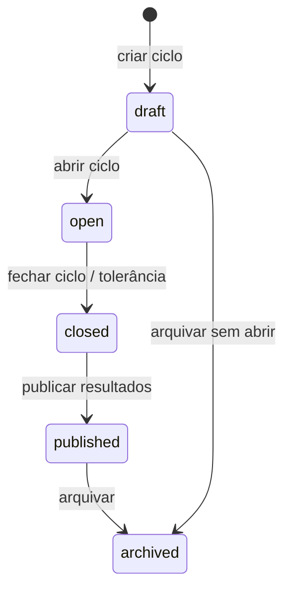
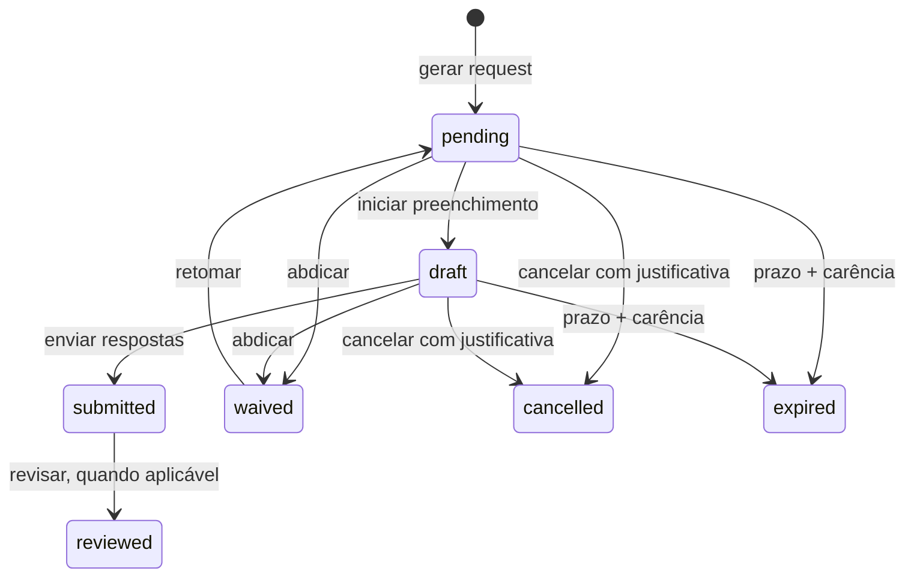
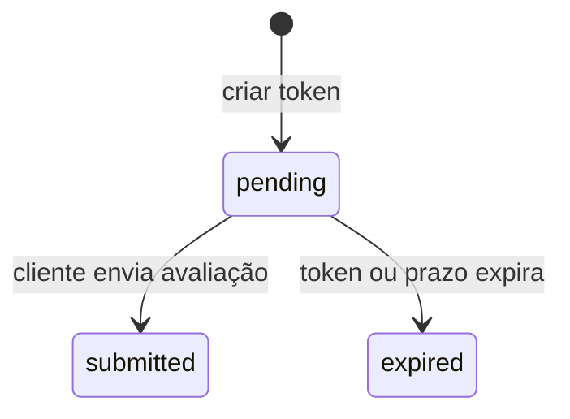

# Máquinas de Estado

## Ciclo de feedback

🟢 **CONFIRMADO:** os estados aparecem nas operações de `AdminCiclos.tsx`. Os gatilhos acima são os nomes observados nas ações de interface; a aplicação de transições adicionais no banco é 🔴 **LACUNA**.

## Request de feedback interno

- 🟢 `pending`, `draft` e `submitted` são usados diretamente no formulário e dashboards.
- 🟢 `waived`, `cancelled` e `expired` aparecem nas visões de histórico, pendências e relatórios.
- 🟡 `reviewed` aparece no mapa de status de relatórios, mas seu gatilho não foi localizado.
- 🟢 Requests em `cancelled` ou `waived` são excluídos de várias métricas de progresso.

## Avaliação pública de cliente

🟢 **CONFIRMADO:** a página pública valida `status = pending` e expiração antes de atualizar para `submitted`.

## Validação humana — 2026-08-25

- 🟢 `feedback_contacts`: `novo → em_andamento → resolvido`.
- 🟡 `team_requests`: aprovação/rejeição pelo gestor da própria equipe foram confirmadas; cancelamento, expiração e demais transições permanecem sem contrato formal.
