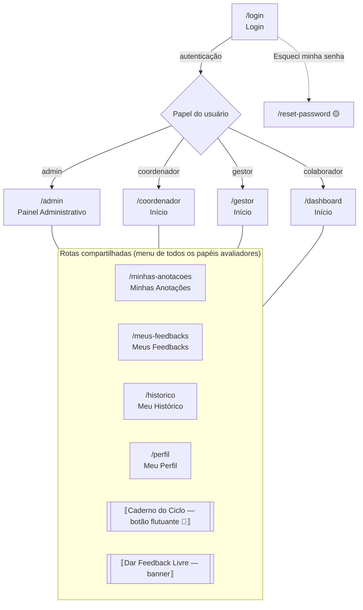
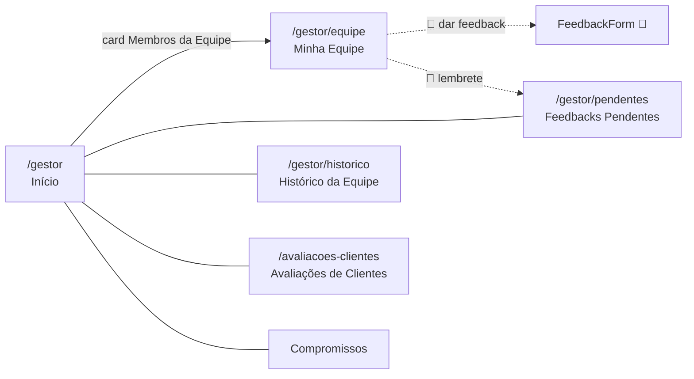
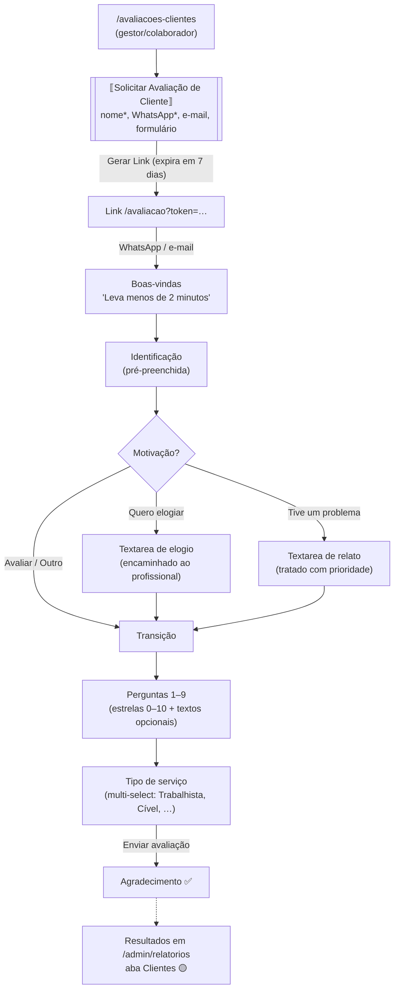
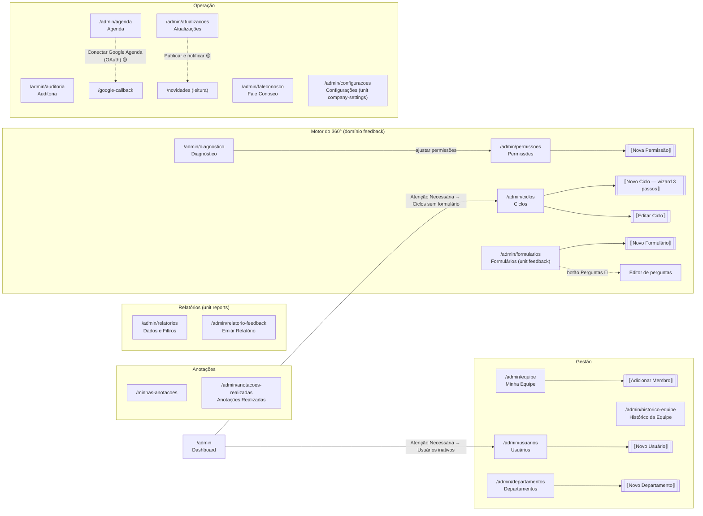
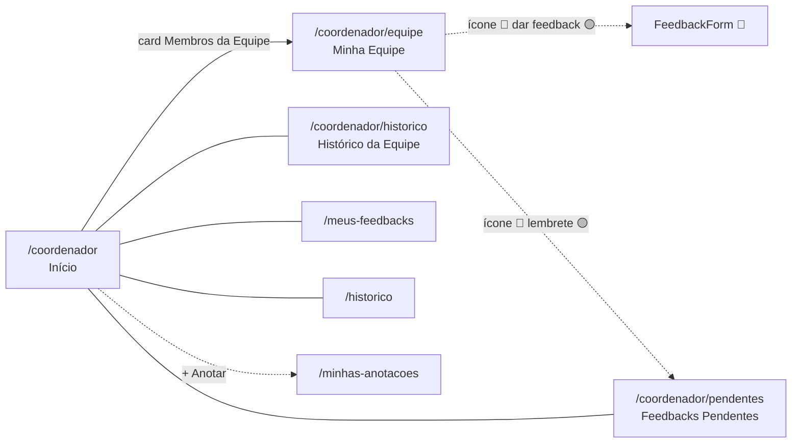

# Fluxo de Navegação — A&S Feedback Hub

> Gerado pelo Visor (Reversa) em 2026-08-28. Baseado nos menus laterais e ações observadas nos screenshots; setas 🟡 são inferidas do código/rotas quando a transição não foi capturada.
> Legenda: retângulos = páginas; subrotinas ⟦⟧ = modais; tracejado = fluxo não capturado (inferido).

## Visão geral (papéis capturados: Admin e Coordenador)

## Área do gestor (menu lateral)

## Fluxo de avaliação do cliente externo (capturado de ponta a ponta)

## Área administrativa (menu lateral do admin)

## Área do coordenador (menu lateral)

## Fluxos principais identificados

1. **Ciclo 360° (admin):** Formulários → Ciclos (criar com formulário associado) → Permissões (quem avalia quem) → Diagnóstico (validar antes do fechamento) → fechamento automático 08:00 (auditoria) → Publicar resultados → aparecem em Meu Histórico dos avaliados 🟡
2. **Avaliação pelo avaliador:** Meus Feedbacks (requests pendentes) → FeedbackForm (responder) 🟡 → enviado/abdicado → Auditoria registra "Feedback 360° Enviado" 🟢
3. **Feedback livre:** banner "Dar Feedback para alguém" (qualquer tela inicial) → envio → destinatário dá ciência (badge "Ciente em …") → visível em Histórico da Equipe 🟢
4. **Supervisão (coordenador/admin):** Início (KPIs) → Feedbacks Pendentes → lembrete 🔔 → Histórico da Equipe 🟢
5. **Avaliação de cliente externo:** Avaliações de Clientes (solicitar → gerar link tokenizado, expira em 7 dias, enviado por WhatsApp com template de Configurações) → wizard público `/avaliacao?token=…` (motivação com ramos, 9 perguntas, tipo de serviço) → resultados em Relatórios aba Clientes 🟢 (fluxo capturado de ponta a ponta)
6. **Denúncia protegida:** modal Dar Feedback Livre → checkbox de situação grave (assédio, discriminação…) → feedback oculto do destinatário, visível só a gestores/admins 🟢
7. **Anotação contínua:** Caderno do Ciclo (botão 📖 flutuante, texto ou áudio) → Minhas Anotações → subsidia o preenchimento dos feedbacks do ciclo 🟢

## Pontos de entrada e saída

- **Entrada:** `/login` (único ponto autenticado observado); `ClientFeedbackPage` pública via link enviado ao cliente 🟡
- **Saída:** item "Sair" no rodapé do menu lateral (todas as telas) 🟢
